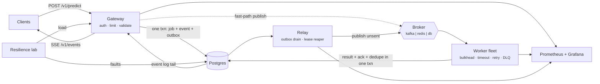

<div align="center">

# AegisFlow

**Event-driven ML inference platform with chaos-verified fault tolerance.**

Durable ingest, an elastic worker fleet, and a resilience lab that breaks the platform on
purpose and reports what happened.

[](../../actions/workflows/ci.yml)


</div>

---

## What this is

A small, complete distributed system that answers one question honestly: **what happens to your
work when infrastructure fails?**

Most inference services are a model behind a web framework. They lose requests when the broker
hiccups, double-process on redelivery, and have no way to prove otherwise. AegisFlow makes the
failure paths first-class:

- a request is acknowledged **only** after it is durable, using a transactional outbox;
- workers hold **leases**, not ownership, so killing one mid-job loses nothing;
- the queue ack is committed **in the same transaction as the result**, so a replay cannot
  double-write;
- a built-in **resilience lab** drives load, injects a real fault mid-run, and reconciles every
  accepted job against every terminal state before printing a verdict.

Four services, one image, three interchangeable brokers, one operator console.

## Measured results

From `python scripts/drills.py` on a single laptop, SQLite + the database-backed queue,
2 worker processes (the cheapest possible configuration). Full table: [`docs/benchmarks.md`](docs/benchmarks.md).

| Drill (25 rps, 24 s, one fault injected mid-run) | Result |
| --- | --- |
| `baseline` | submit p50 **64 ms** / p95 **359 ms**, 600/600 completed, backlog drained in **1.15 s**, **0** lost |
| `worker-loss` — whole fleet paused | backlog absorbed, throughput recovered in **< 1 s** after the fault cleared, **0** lost |
| `broker-outage` — publishing fails | ingest stayed up, work parked in the outbox, drained in **3.84 s**, recovery **2 s**, **0** lost |
| `db-slowdown` — +800 ms storage latency | absorbed by timeouts and retries, **0** lost |
| `poison-payloads` — 30 % of model calls fail | **76** retries, **1** dead letter, queue kept moving, **0** lost |
| `burst` — 3× arrival rate | **41.5 rps** absorbed, drained in **12 s**, **0** lost |
| smoke suite | **10/10** checks, including retry → dead-letter → replay → success |

Zero lost jobs across all six drills — 3,300+ accepted requests reconciled one by one against
terminal state. SQLite serialises writes, so ~25–40 jobs/s is the laptop ceiling;
`docker compose up` (Postgres + Redpanda + Redis) is the path for production-shaped throughput.

## Architecture



Details: [`docs/architecture.md`](docs/architecture.md) ·
Failure mechanisms: [`docs/fault-tolerance.md`](docs/fault-tolerance.md) ·
Operations: [`docs/runbook.md`](docs/runbook.md)

## Guarantees

| Invariant | Mechanism | Evidence |
| --- | --- | --- |
| No accepted job is lost | transactional outbox, durable queue, lease reaper | `unaccounted_jobs = 0` in `/v1/stats` and in every drill verdict |
| Duplicate delivery is harmless | inbox dedupe table; DB-broker ack inside the result transaction | exactly-once on `db`, effectively-once on Kafka/Redis |
| Transient faults self-heal | exponential backoff with full jitter, capped attempts | `retry` events in the audit log |
| Bad input never blocks the queue | permanent vs transient error split, 422 at the edge, DLQ + replay | `POST /v1/dlq/{id}/replay` |
| Slow dependencies stay contained | circuit breaker, bulkhead, per-job timeout | `aegisflow_circuit_breaker_state` |
| Degraded beats down | model fallback, cache/limiter fail open, ingest survives broker loss | `degraded` flag on results |

## Quickstart

### Laptop, no Docker required

<details open>
<summary><b>Windows (PowerShell)</b></summary>

```powershell
.\scripts\dev.ps1 setup     # venv, dependencies, train the bundled models, seed .env
.\scripts\dev.ps1 up        # gateway + 2 workers + relay + lab
.\scripts\dev.ps1 status
.\scripts\dev.ps1 smoke     # one prediction, end to end
.\scripts\dev.ps1 drill -Scenario worker-loss
```

</details>

<details>
<summary><b>Linux / macOS</b></summary>

```bash
make setup
make up
make smoke
make drill SCENARIO=worker-loss RPS=40 DURATION=30
```

</details>

Then the console:

```bash
cd web && npm install && npm run dev     # http://localhost:3000
```

Defaults: SQLite for storage, the database-backed queue for messaging, no Redis, no Kafka.
Gateway docs at <http://localhost:8000/docs>, lab docs at <http://localhost:8100/docs>.

### Full stack in Docker

```bash
docker compose up -d --build
```

| Service | URL |
| --- | --- |
| Console | <http://localhost:3000> |
| Gateway (OpenAPI) | <http://localhost:8000/docs> |
| Resilience lab | <http://localhost:8100/docs> |
| Prometheus | <http://localhost:9090> |
| Grafana (admin / aegisflow) | <http://localhost:3001> |

Compose runs Postgres, Redpanda (Kafka API), Redis, three worker replicas, Prometheus and a
provisioned Grafana dashboard.

## API

```bash
# submit and wait for the result
curl -X POST localhost:8000/v1/predict \
  -H 'X-API-Key: demo-key-aegisflow' -H 'content-type: application/json' \
  -d '{"model":"sentiment-v1","input":{"text":"courier arrived early"},"wait_ms":3000}'

# platform state
curl localhost:8000/v1/stats -H 'X-API-Key: demo-key-aegisflow'

# break something (admin key), then watch /v1/events
curl -X POST localhost:8000/v1/chaos \
  -H 'X-API-Key: admin-key-aegisflow' -H 'content-type: application/json' \
  -d '{"target":"worker","mode":"pause","probability":1,"ttl_s":20}'

# run a full drill and get a verdict
curl -X POST localhost:8000/v1/lab/loadtest -H 'content-type: application/json' \
  -d '{"scenario":"worker-loss","rps":25,"duration_s":24,"fault_at_s":8,"fault_duration_s":10}'
```

| Endpoint | Purpose |
| --- | --- |
| `POST /v1/predict` · `/v1/predict/batch` | submit work (`wait_ms` for a synchronous answer) |
| `GET /v1/jobs/{id}` · `GET /v1/jobs` | job state and history |
| `GET /v1/events` | SSE tail of the audit log |
| `GET /v1/stats` · `GET /metrics` | platform state · Prometheus metrics |
| `GET /v1/models` | registry with training metrics |
| `GET /v1/dlq` · `POST /v1/dlq/{id}/replay` | dead letters and replay |
| `GET|POST|DELETE /v1/chaos` | fault injection (admin) |
| `POST /v1/lab/loadtest` · `GET /v1/lab/report` | drills and best-per-scenario report |

## Console

Three screens, built to be operated rather than admired:

- **Console** — submit inference, live SSE event log, throughput and latency sparklines, worker
  fleet, queue internals, dead letters with one-click replay, fault-injection presets.
- **Resilience** — pick a scenario, set the rate, watch accepted-vs-completed diverge during the
  fault and converge after it, then read the verdict.
- **Architecture** — request lifecycle, delivery semantics, failure matrix, design decisions.

Deployed without a backend it runs against an in-browser simulator
(`NEXT_PUBLIC_USE_MOCKS=true`) so the public demo stays alive; point it at a gateway with
`NEXT_PUBLIC_USE_MOCKS=false` and `NEXT_PUBLIC_API_URL`.

## Deployment

| Target | How |
| --- | --- |
| Kubernetes | `kubectl apply -k deploy/k8s` — probes, HPA, PDB, topology spread, NetworkPolicy, Ingress with SSE buffering disabled |
| KEDA / Prometheus operator | `kubectl apply -f deploy/k8s/optional/keda-and-monitoring.yaml` — scale workers on consumer lag |
| Render | `deploy/render.yaml` — `BROKER=db`, managed Postgres, no Kafka needed |
| Vercel | deploy `web/` with `NEXT_PUBLIC_USE_MOCKS=true` for the public demo |
| CI | `.github/workflows/ci.yml` — lint, train, boot the stack, smoke test, typecheck, build and push both images |

## Repository layout

```
aegisflow_core/        shared library: config, storage, broker, resilience, chaos, inference
  broker/              db queue · redis streams · kafka, one interface
services/gateway/      public API, SSE, admin, lab proxy
services/worker/       consumer: dedupe, bulkhead, timeout, retry, DLQ
services/relay/        outbox drain, lease reaper, janitor
services/lab/          load generation, fault scheduling, verdicts
ml/train.py            trains the three bundled scikit-learn models
web/                   Next.js operator console
observability/         Prometheus config, alert rules, Grafana dashboard
deploy/                kustomize manifests, KEDA, Render blueprint
scripts/               dev.ps1, verify.ps1, smoke.py, drills.py
docs/                  architecture, fault tolerance, runbook, benchmarks
```

## Models

Three scikit-learn pipelines ship with the repo so the platform is demonstrable end to end:
`sentiment-v1` (word TF-IDF + logistic regression), `sentiment-v2` (character n-gram SVM, for
canary traffic) and `embed-v1` (TF-IDF + SVD, 64-dim vectors). They are trained at image build
time from a templated corpus — the accuracy figures are a property of that corpus, not a
benchmark claim. Point `ml/train.py --csv` at real `text,label` data, or replace `_PREDICTORS`
in `aegisflow_core/inference.py` with an ONNX, torch or remote model; nothing else changes.

## Notes and limits

- The database is the one hard dependency. Broker, cache and model artifacts can all fail
  without taking ingest down; the database cannot, because durability is the promise.
- `TRACK_RUNNING_STATE=false` by default: writing an explicit `running` transition costs one
  extra round trip per job. Turn it on when you want per-job state transitions in the UI.
- The relay is a single logical owner. Two replicas are safe (all writes are idempotent) but
  redundant.
- If your checkout path contains an `&`, npm scripts fail on Windows (`cmd.exe` splits the path).
  Use `node node_modules/next/dist/bin/next dev` or move the project.

## License

MIT — see [LICENSE](LICENSE).

Built by **Shahriar Ahmed Seam** · Somokolon Labs.
Photography in the console by Panumas Nikhomkhai, Brett Sayles and Tom de Monteiller on
[Pexels](https://www.pexels.com).
