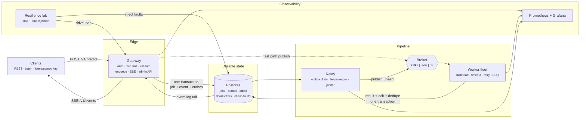

# Architecture

AegisFlow is an event-driven ML inference platform built around one rule: **a request
that has been acknowledged must reach a terminal state, whatever fails next.**

Four services share a single image. The broker is pluggable, so the same code runs on
Kafka in production and on a database-backed queue on a laptop.

## Services

| Service | Role | Scaling | Failure mode |
| --- | --- | --- | --- |
| `gateway` | Only internet-facing component. Auth, rate limiting, validation, durable enqueue, read APIs, SSE, chaos + DLQ admin, proxy to the lab. | Stateless, HPA on CPU/RPS | Replicas are interchangeable; losing one drops in-flight HTTP only |
| `worker` | Claims messages, runs the model, writes terminal state. | Stateless, HPA/KEDA on queue depth | Safe to kill: leases expire and work is requeued |
| `relay` | Drains the outbox, reaps expired leases, prunes old rows, keeps gauges warm. | One logical owner, idempotent writes | If it stops, nothing is lost; publishing is simply delayed |
| `lab` | Generates paced load, injects faults on a schedule, reconciles results into a verdict. | Single instance | Purely diagnostic; not on the request path |

## Request lifecycle

1. **Admission** — API key, token-bucket rate limit, Pydantic validation, model-level input
   validation, optional idempotency key that collapses duplicate submissions onto one job.
2. **Durable enqueue** — one transaction writes the `jobs` row, a `job_events` audit row and
   the `outbox` intent. With the DB broker the queue insert joins that same transaction; with
   Kafka the publish happens immediately after commit and the relay covers failures.
3. **Claim** — a worker claims a batch with a single atomic `UPDATE` stamped with a claim token
   and a lease. No advisory locks, so Postgres and SQLite behave identically. Kafka mode uses
   consumer groups with manual offset commits.
4. **Compute** — the model runs in a worker thread under a per-job timeout inside a bulkhead
   that caps concurrency. Missing artifacts fall back to a heuristic and mark the result
   `degraded` rather than failing.
5. **Commit** — result, audit event, dedupe marker and (for the DB broker) the queue ack land in
   one transaction. Kafka commits its offset right after the write, with the inbox table
   absorbing replays.
6. **Fan-out** — the append-only event log is tailed over SSE, terminal results are cached, and
   Prometheus scrapes every service.

## Delivery semantics

| Broker | Guarantee | How |
| --- | --- | --- |
| `db` | exactly-once | the ack is part of the transaction that writes the result |
| `kafka` | effectively-once | manual offset commit after the write + inbox dedupe table |
| `redis` | effectively-once | `XACK` after the write + inbox dedupe table |

Ordering is per job key. Nothing in the platform requires global ordering, which is what
allows workers to scale horizontally without coordination.

## Data model

| Table | Purpose |
| --- | --- |
| `jobs` | Source of truth for a request: input, status, attempts, result, timings |
| `outbox` | Publish intents written with the job; `published_at` stamped once the broker has it |
| `broker_messages` | Storage for the built-in queue: lease, attempt, visibility timeout |
| `processed_messages` | Inbox/dedupe keys that make duplicate delivery a no-op |
| `job_events` | Append-only audit log; also the tail that feeds the live SSE stream |
| `dead_letters` | Exhausted jobs with the failure reason, replayable through the API |
| `chaos_faults` | Active fault injections with TTL, read by every service |
| `worker_heartbeats` | Fleet view: state, in-flight, processed, failed |
| `load_runs` | Drill parameters, timelines, metrics and verdicts |

## Backpressure and scaling

- Workers prefetch a bounded batch and never claim more than the bulkhead can hold, so a
  backlog grows in the queue rather than in worker memory.
- Queue depth, not CPU, is the correct scaling signal. The HPA includes a CPU target for
  clusters without custom metrics; `deploy/k8s/optional` has a KEDA `ScaledObject` that scales
  on real consumer lag.
- The gateway stays available during broker outages because acceptance only needs the database.
  Ingest availability and processing availability are deliberately decoupled.

## Configuration surface

Every knob is an environment variable (see `.env.example`). The ones that change behaviour
most: `BROKER`, `DATABASE_URL`, `WORKER_CONCURRENCY`, `MAX_ATTEMPTS`, `JOB_TIMEOUT_MS`,
`VISIBILITY_TIMEOUT_S`, `RATE_LIMIT_PER_MINUTE`, `TRACK_RUNNING_STATE`.
